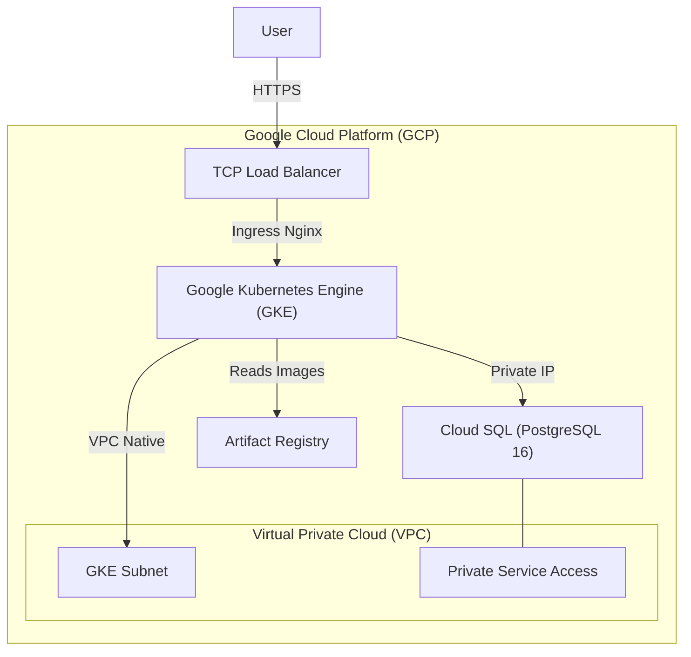
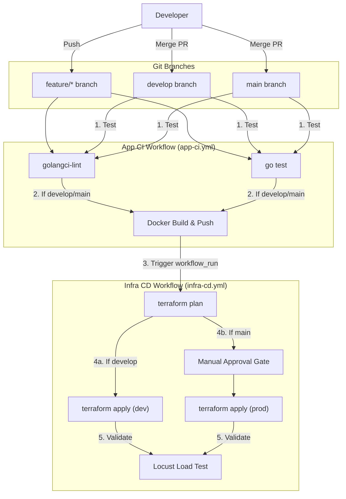

# Deployment Guide

This document outlines the architecture and deployment processes for the Task Manager project.

## 1. GCP Infrastructure Architecture

The following diagram illustrates the resources provisioned in Google Cloud Platform:



**Key Components:**
- **VPC & Subnets:** Custom network with dedicated secondary ranges for Pods and Services.
- **GKE:** A Kubernetes cluster using Workload Identity to securely interact with GCP services.
- **Cloud SQL:** Private PostgreSQL database accessible only from the VPC via Private Services Access.
- **Artifact Registry:** Dedicated Docker repository for storing application images.
- **Ingress-Nginx:** Manages external traffic routing to the application services.

---

## 2. CI/CD Pipeline Architecture (GitFlow)

We use GitHub Actions to automate the continuous integration and continuous deployment processes.



### Pipelines Breakdown
- **App CI (`app-ci.yml`)**: Unconditionally runs the Go linter and unit tests. If the branch is `develop` or `main`, it builds the Docker image and pushes it to Artifact Registry tagged with the Git SHA.
- **Infra CD (`infra-cd.yml`)**: Triggered upon App CI success. It dynamically targets the Terraform `dev` or `prod` environment. For `prod`, it pauses for manual approval via GitHub Environments. On successful deployment, it executes a Locust load test.

---

## 3. Initial Setup Instructions

Before utilizing the CI/CD pipelines, the following manual setup is required:

### A. Create Terraform State Buckets
Since Terraform manages the entire infrastructure, the state buckets must be created manually first.
```bash
# Set your active project
gcloud config set project your-gcp-project-id

# Create DEV state bucket
gcloud storage buckets create gs://terraform-state-task-manager-dev --location=europe-west9

# Create PROD state bucket
gcloud storage buckets create gs://terraform-state-task-manager-prod --location=europe-west9
```

### B. Configure Workload Identity Federation for GitHub Actions
We use keyless authentication to GCP. You need to create a Workload Identity Pool and Provider in your GCP project so GitHub Actions can securely authenticate without needing a JSON service account key.

Run the following script locally to configure it:

```bash
# 1. Set your GCP project ID
export YOUR_PROJECT_ID="your-gcp-project-id"
export YOUR_GITHUB_ORG="your-github-username-or-org"
export YOUR_REPO="your-repo-name"

# 2. Create the Workload Identity Pool
gcloud iam workload-identity-pools create "github-actions-pool" \
  --project="${YOUR_PROJECT_ID}" \
  --location="global" \
  --display-name="GitHub Actions Pool"

# 3. Create the OIDC Provider
gcloud iam workload-identity-pools providers create-oidc "github-actions-provider" \
  --project="${YOUR_PROJECT_ID}" \
  --location="global" \
  --workload-identity-pool="github-actions-pool" \
  --display-name="GitHub Actions Provider" \
  --attribute-mapping="google.subject=assertion.sub,attribute.actor=assertion.actor,attribute.repository=assertion.repository" \
  --attribute-condition="assertion.repository == '${YOUR_GITHUB_ORG}/${YOUR_REPO}'" \
  --issuer-uri="https://token.actions.githubusercontent.com"

# 4. Get your Project Number (Required for GitHub workflows)
PROJECT_NUMBER=$(gcloud projects describe ${YOUR_PROJECT_ID} --format="value(projectNumber)")
echo "Your Project Number is: ${PROJECT_NUMBER}"

# 5. Bind the policy to your Service Account
gcloud iam service-accounts add-iam-policy-binding "github-actions-sa@${YOUR_PROJECT_ID}.iam.gserviceaccount.com" \
  --project="${YOUR_PROJECT_ID}" \
  --role="roles/iam.workloadIdentityUser" \
  --member="principalSet://iam.googleapis.com/projects/${PROJECT_NUMBER}/locations/global/workloadIdentityPools/github-actions-pool/attribute.repository/${YOUR_GITHUB_ORG}/${YOUR_REPO}"
```

Then workflows use repository **Variables** (not Secrets) for identifiers such as the GCP project ID and project number — these values are not sensitive credentials.

1. Open your repository **Settings**.
2. In the sidebar, click **Secrets and variables**, then **Actions**.
3. Open the **Variables** tab (next to **Secrets**).
4. Click **New repository variable** and add the following two entries:
   - **Name:** `GCP_PROJECT_ID` — **Value:** your GCP project ID (the same value you set as `YOUR_PROJECT_ID` in section B).
   - **Name:** `GCP_PROJECT_NUMBER` — **Value:** the project number printed by step 4 of the Workload Identity script (`echo "Your Project Number is: …"`).

### D. Configure GitHub Environments
To enable the manual approval gate for Production deployments:
1. Navigate to your repository **Settings > Environments**.
2. Create an environment named `prod`.
3. Check the **Required reviewers** box and select the approved individuals or teams.

### E. Update Terraform tfvars
In both `infrastructure/environments/dev/terraform.tfvars.example` and `infrastructure/environments/prod/terraform.tfvars.example`:
1. Copy the files to remove the `.example` extension:
```bash
cp infrastructure/environments/dev/terraform.tfvars.example infrastructure/environments/dev/terraform.tfvars
cp infrastructure/environments/prod/terraform.tfvars.example infrastructure/environments/prod/terraform.tfvars
```
2. Replace `project-c146e532-e1f5-4e81-860` / `your-gcp-project-id` with your actual GCP Project ID.

---

## 4. Bootstrapping the Infrastructure (First Time Deployment)

Because the CI/CD pipeline pushes Docker images to Artifact Registry, and the CD pipeline relies on self-hosted runners (ARC) inside the GKE cluster, there is a "Chicken and the Egg" dependency cycle. To resolve this, you must run Terraform locally for the very first deployment.

### A. Configure GitHub Secrets
Navigate to your repository **Settings > Secrets and variables > Actions > Secrets** and click **New repository secret** to add:
- `JWT_SECRET`: Your application's JWT signature secret.
- `PAT`: A GitHub Personal Access Token (classic) with `repo` permissions to allow the ARC runners to register.

### B. Deploy Core Infrastructure Locally
Deploy only the foundational infrastructure (Network, GKE, Database, Artifact Registry, and ARC). We specifically skip the `helm` module (which deploys your application) because the Docker image hasn't been built and pushed to the registry yet.

```bash
cd infrastructure/environments/dev

# Initialize Terraform
terraform init

# Apply core infrastructure targets explicitly avoiding the app helm chart
terraform apply -target=module.network \
                -target=module.database \
                -target=module.gke \
                -target=module.artifact_registry \
                -target=module.arc \
                -var="github_pat=YOUR_GITHUB_PAT"

# Repeat for the prod environment
cd ../prod
terraform init
terraform apply -target=module.network \
                -target=module.database \
                -target=module.gke \
                -target=module.artifact_registry \
                -target=module.arc \
                -var="github_pat=YOUR_GITHUB_PAT"
```

### C. Trigger the CI/CD Pipeline
Now that the Artifact Registries and ARC Runners exist and are active in both environments:
1. Commit and push your code to GitHub (`main` or `develop` branches).
2. The `app-ci.yml` workflow will now successfully build and push the first Docker image into Artifact Registry.
3. The `infra-cd.yml` workflow will automatically trigger, run on your self-hosted GKE runners, and apply the complete Terraform state (deploying the database credentials and the `helm` application module).

Your application is now fully automated!