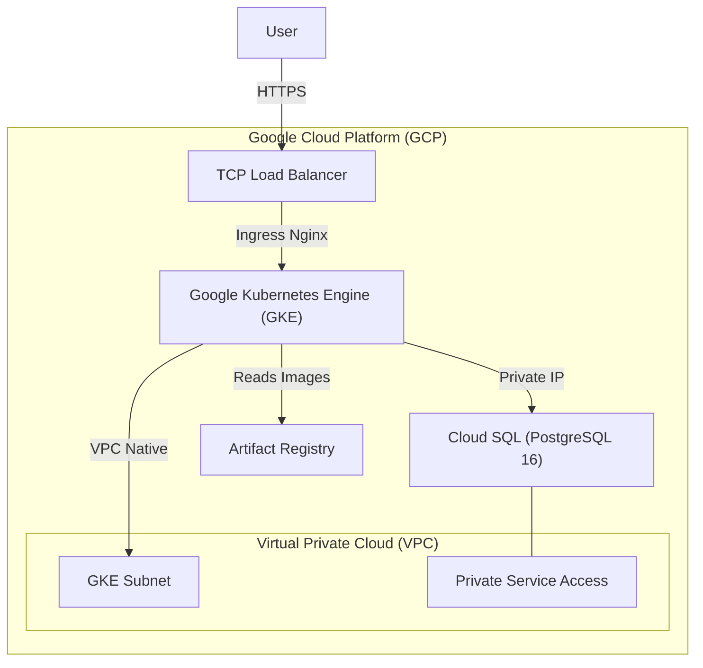
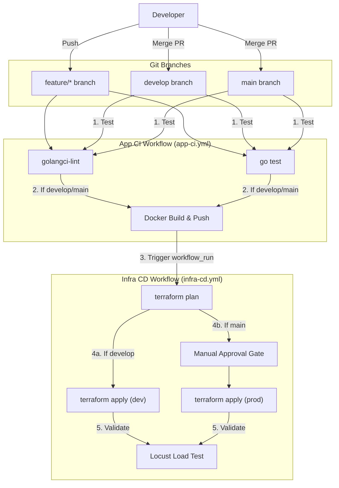

# Deployment Guide

This document outlines the architecture and deployment processes for the Task Manager project.

## 1. GCP Infrastructure Architecture

The following diagram illustrates the resources provisioned in Google Cloud Platform:



**Key Components:**
- **VPC & Subnets:** Custom network with dedicated secondary ranges for Pods and Services.
- **GKE:** A Kubernetes cluster using Workload Identity to securely interact with GCP services.
- **Cloud SQL:** Private PostgreSQL database accessible only from the VPC via Private Services Access.
- **Artifact Registry:** Dedicated Docker repository for storing application images.
- **Ingress-Nginx:** Manages external traffic routing to the application services.

---

## 2. CI/CD Pipeline Architecture (GitFlow)

We use GitHub Actions to automate the continuous integration and continuous deployment processes.



### Pipelines Breakdown
- **App CI (`app-ci.yml`)**: Unconditionally runs the Go linter and unit tests. If the branch is `develop` or `main`, it builds the Docker image and pushes it to Artifact Registry tagged with the Git SHA.
- **Infra CD (`infra-cd.yml`)**: Triggered upon App CI success. It dynamically targets the Terraform `dev` or `prod` environment. For `prod`, it pauses for manual approval via GitHub Environments. On successful deployment, it executes a Locust load test.

---

## 3. Initial Setup Instructions

Before utilizing the CI/CD pipelines, the following manual setup is required:

### A. Create Terraform State Buckets
Since Terraform manages the entire infrastructure, the state buckets must be created manually first.
```bash
# Set your active project
gcloud config set project your-gcp-project-id

# Create DEV state bucket
gcloud storage buckets create gs://terraform-state-task-manager-dev --location=europe-west9

# Create PROD state bucket
gcloud storage buckets create gs://terraform-state-task-manager-prod --location=europe-west9
```

### B. Configure GitHub Repository Secrets
Navigate to your repository **Settings > Secrets and variables > Actions** and add the following:

- `GCP_CREDENTIALS`: The raw JSON of a GCP Service Account key with sufficient privileges (Owner or Editor).
  > **Note:** Alternatively, set up Workload Identity Federation for keyless authentication and provide the configuration map.

### C. Configure GitHub Environments
To enable the manual approval gate for Production deployments:
1. Navigate to your repository **Settings > Environments**.
2. Create an environment named `prod`.
3. Check the **Required reviewers** box and select the approved individuals or teams.

### D. Update Terraform tfvars
In both `infrastructure/environments/dev/terraform.tfvars.example` and `infrastructure/environments/prod/terraform.tfvars.example`:
1. Rename the files to `terraform.tfvars`.
2. Replace `your-gcp-project-id` with your actual GCP Project ID.
3. Update `jwt_secret` or configure your Actions to inject the secret during `terraform apply` using `TF_VAR_jwt_secret`.
