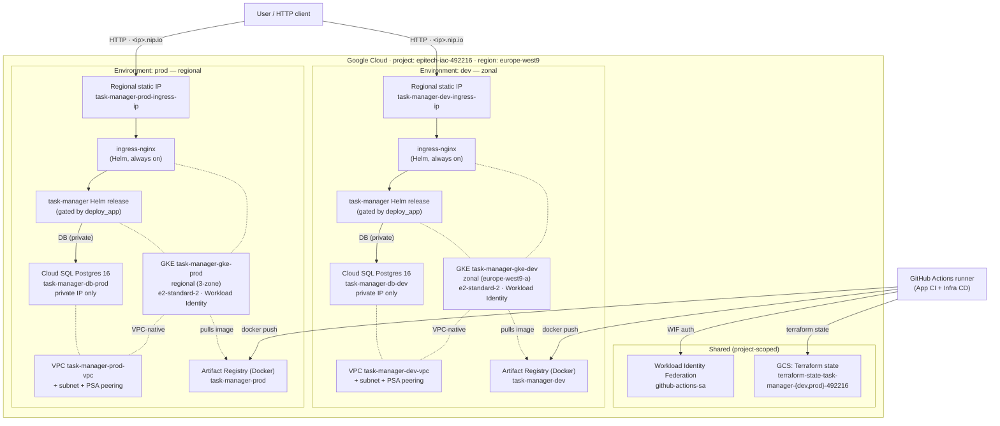
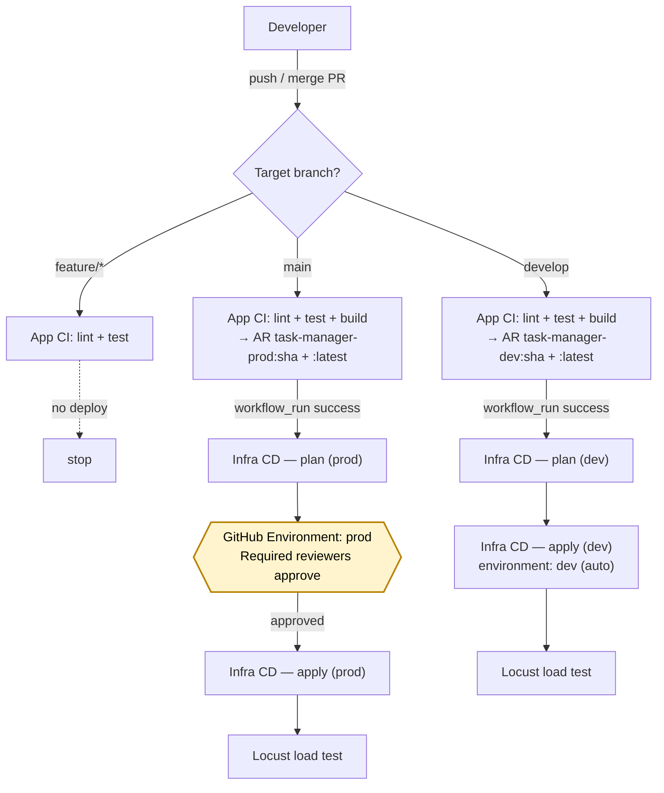

# Deployment Guide

This document outlines the architecture and deployment processes for the Task Manager project.

## 1. GCP Infrastructure Architecture

The following diagram illustrates the resources provisioned in Google Cloud Platform:

Each environment is an **isolated replica** of the same stack in the same GCP project and region (`europe-west9`). Only the resource names, VPC CIDRs, and sizing differ.



**Key components (identical in both environments):**
- **VPC + subnet + PSA peering:** Custom network with dedicated secondary ranges for Pods and Services, plus Private Service Access so Cloud SQL is reachable only over internal IP.
- **GKE:** Kubernetes cluster using Workload Identity to reach Artifact Registry and Cloud SQL without static keys. Dev is **zonal** (cheaper, faster create, avoids cross-zone stockouts); prod is **regional** (HA control plane).
- **Cloud SQL:** Private PostgreSQL 16, accessible only from the VPC via PSA.
- **Artifact Registry:** Dedicated Docker repository per environment (`task-manager-dev`, `task-manager-prod`).
- **ingress-nginx + static IP:** Traffic entry via a regional external IP. The Helm release deploys `ingress-nginx` which binds to that IP and routes `<ip>.nip.io` to the app.
- **task-manager Helm release:** Gated by the `deploy_app` variable so first-time bootstrap can run before any image is pushed (see **§ 4**).

---

## 2. CI/CD Pipeline Architecture (GitFlow)

We use GitHub Actions to automate the continuous integration and continuous deployment processes.



### Pipelines breakdown
- **App CI (`app-ci.yml`)** — runs `golangci-lint` and `go test -race` on every push. On `develop` or `main`, it also builds a Docker image and pushes two tags to the environment-matching Artifact Registry repo: `:<sha>` (immutable) and `:latest`.
- **Infra CD (`infra-cd.yml`)** — triggered via `workflow_run` when App CI succeeds on `develop` or `main`. Split into three jobs:
  1. **`plan`** — runs `terraform init` + `validate` + `plan` and prints the plan to the job log. Always runs; no approval needed.
  2. **`apply`** — gated by a GitHub **Environment** (`dev` or `prod`). For `prod`, the `Required reviewers` protection rule holds the job until a listed reviewer approves in the GitHub UI — the approver can inspect the plan output from step 1 before saying yes. For `dev` the environment has no reviewers, so it proceeds automatically.
  3. **`load-test`** — runs Locust against the ingress URL emitted by the apply job.

### Manual approval for `main` — how it's enforced
1. The `apply` job declares `environment: prod` when the source branch is `main`.
2. GitHub inspects the `prod` Environment's protection rules.
3. Because `prod` has `Required reviewers` configured (see **§ 3.D**), the job enters a `Waiting` state with a **Review deployments** button. Only listed reviewers can approve or reject.
4. Only after an approval does the `apply` job run `terraform apply`.

**If the `prod` Environment is not configured in the repository settings, there is no gate** — GitHub will run the apply immediately. Confirm that § 3.D has been completed before pushing to `main`.

---

## 3. Initial Setup Instructions

Before utilizing the CI/CD pipelines, the following manual setup is required:

If services not enable yet on the fresh project
```bash
gcloud services enable compute.googleapis.com container.googleapis.com artifactregistry.googleapis.com sqladmin.googleapis.com servicenetworking.googleapis.com cloudresourcemanager.googleapis.com --project="YOUR_NEW_PROJECT_ID"
```

### A. Create Terraform State Buckets
Since Terraform manages the entire infrastructure, the state buckets must be created manually first.
```bash
# Set your active project
gcloud config set project your-gcp-project-id

# Create DEV state bucket
gcloud storage buckets create gs://terraform-state-task-manager-dev --location=europe-west9

# Create PROD state bucket
gcloud storage buckets create gs://terraform-state-task-manager-prod --location=europe-west9
```

### B. Configure Workload Identity Federation for GitHub Actions
We use keyless authentication to GCP. You need to create a Workload Identity Pool and Provider in your GCP project so GitHub Actions can securely authenticate without needing a JSON service account key.

Run [`scripts/gcp/setup-github-actions-wif.sh`](scripts/gcp/setup-github-actions-wif.sh) from the repository root. Configure it by exporting **YOUR_PROJECT_ID** (GCP project ID), **YOUR_GITHUB_ORG** (GitHub user or organization), and **YOUR_REPO** (repository name), then execute the script:

```bash
chmod +x scripts/gcp/setup-github-actions-wif.sh

export YOUR_PROJECT_ID="your-gcp-project-id"
export YOUR_GITHUB_ORG="your-github-org-or-username"
export YOUR_REPO="your-repo-name"

./scripts/gcp/setup-github-actions-wif.sh
```

Alternatively, pass the same three values as positional parameters (no `export` required):

```bash
./scripts/gcp/setup-github-actions-wif.sh your-gcp-project-id your-github-org-or-username your-repo-name
```

The script prints **Your Project Number is:** … — use that value when configuring GitHub Variables in the next section.

### C. Set up GitHub Variables

The workflows use repository **Variables** (not Secrets) for identifiers such as the GCP project ID and project number — these values are not sensitive credentials.

1. Open your repository **Settings**.
2. In the sidebar, click **Secrets and variables**, then **Actions**.
3. Open the **Variables** tab (next to **Secrets**).
4. Click **New repository variable** and add the following two entries:
   - **Name:** `GCP_PROJECT_ID` — **Value:** your GCP project ID (the same value you passed as `YOUR_PROJECT_ID` in section B).
   - **Name:** `GCP_PROJECT_NUMBER` — **Value:** the project number printed at the end of [`setup-github-actions-wif.sh`](scripts/gcp/setup-github-actions-wif.sh) (`Your Project Number is: …`).

### D. Configure GitHub Environments
To enable the manual approval gate for Production deployments:
1. Navigate to your repository **Settings > Environments**.
2. Create an environment named `prod`.
3. Check the **Required reviewers** box and select the approved individuals or teams.

### E. Update Terraform tfvars
In both `infrastructure/environments/dev/terraform.tfvars.example` and `infrastructure/environments/prod/terraform.tfvars.example`:
1. Copy the files to remove the `.example` extension:
```bash
cp infrastructure/environments/dev/terraform.tfvars.example infrastructure/environments/dev/terraform.tfvars
cp infrastructure/environments/prod/terraform.tfvars.example infrastructure/environments/prod/terraform.tfvars
```
2. Replace `your-gcp-project-id` with your actual GCP Project ID.

> **Note:** You do not need to set an `ingress_host`. The Ingress hostname is automatically derived from the provisioned static IP using [nip.io](https://nip.io) (`<ip>.nip.io`), which resolves to that IP without any DNS configuration.

---

## 4. Bootstrapping the Infrastructure (First Time Deployment)

Because the CI/CD pipeline pushes Docker images to Artifact Registry, and the CD pipeline relies on self-hosted runners (ARC) inside the GKE cluster, there is a "Chicken and the Egg" dependency cycle — the first `terraform apply` cannot deploy the `task-manager` Helm release because its container image does not exist yet. The Helm provider runs with `wait = true`, so the release would hang on `ImagePullBackOff` until it times out and fails the apply.

To resolve this, the Helm module exposes a **`deploy_app`** boolean variable (default `true`). On the very first apply, set it to `false` to install every piece of infrastructure except the application release. Once CI has pushed an image to Artifact Registry, flip it back to `true` (the default) and let the CD pipeline take over.

> `ingress-nginx` is still installed during bootstrap — it uses a public chart and reserves the Load Balancer on the pre-allocated static IP, so traffic routing is ready as soon as the app is deployed.

### A. Configure GitHub Secrets
Navigate to your repository **Settings > Secrets and variables > Actions > Secrets** and click **New repository secret** to add:
- `JWT_SECRET`: Your application's JWT signature secret.
- `PAT`: A GitHub Personal Access Token (classic) with `repo` permissions to allow the ARC runners to register.

### B. Deploy Core Infrastructure Locally (bootstrap with `deploy_app=false`)
Run Terraform with `deploy_app=false` to install Network, GKE, Database, Artifact Registry, ARC, and `ingress-nginx` — but skip the `task-manager` Helm release and its Kubernetes secret.

```bash
cd infrastructure/environments/dev

# Initialize Terraform
terraform init

# Save a plan that skips the task-manager release
terraform plan -var="deploy_app=false" \
               -var="github_pat=YOUR_GITHUB_PAT" \ #or set it in variable.tf
               -out=bootstrap.tfplan

# Apply that exact plan file
terraform apply "bootstrap.tfplan"

# Repeat for the prod environment
cd ../prod
terraform init

terraform plan -var="deploy_app=false" \
               -var="github_pat=YOUR_GITHUB_PAT" \
               -out=bootstrap.tfplan

terraform apply "bootstrap.tfplan"
```

After this step:
- GKE is running with the primary node pool ready to receive workloads.
- Cloud SQL is reachable privately over the VPC.
- Artifact Registry exists (empty).
- `ingress-nginx` is installed and bound to the reserved static IP.
- ARC runners are registered with GitHub and able to execute workflows on GKE.
- The `task-manager` Deployment, Service, Ingress, and Secret are **not** created yet.

### C. Trigger the CI/CD Pipeline
Now that the Artifact Registries and ARC Runners exist and are active in both environments:
1. Commit and push your code to GitHub (`main` or `develop` branches).
2. The `app-ci.yml` workflow will now successfully build and push the first Docker image into Artifact Registry.
3. The `infra-cd.yml` workflow automatically triggers on the App CI success, runs on your self-hosted GKE runners, and applies the complete Terraform state. Because `deploy_app` now falls back to its default value (`true`), the `helm` module installs the `task-manager` release against the image that was just pushed, and the application becomes reachable at `http://<ingress_static_ip>.nip.io`.

> If you later need to re-bootstrap (e.g. after a full `terraform destroy` or when onboarding a new GCP project), repeat **4.B** — no source changes required.
