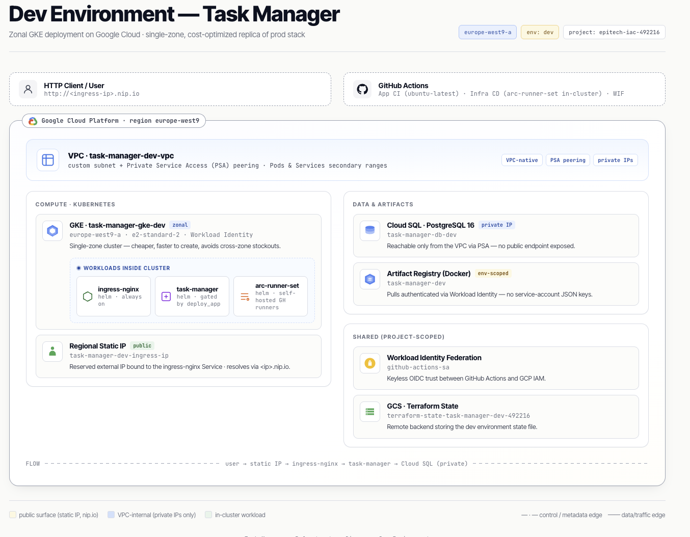
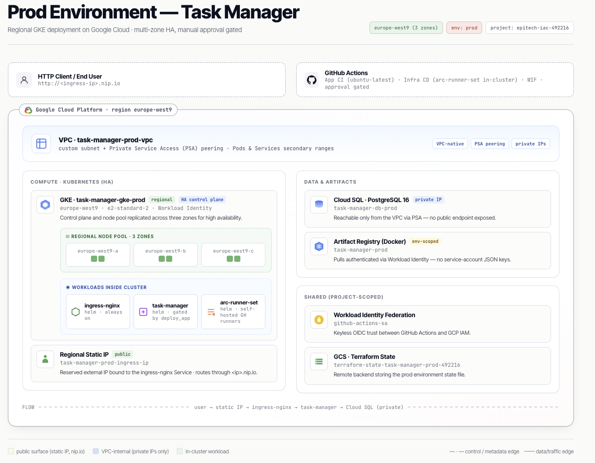
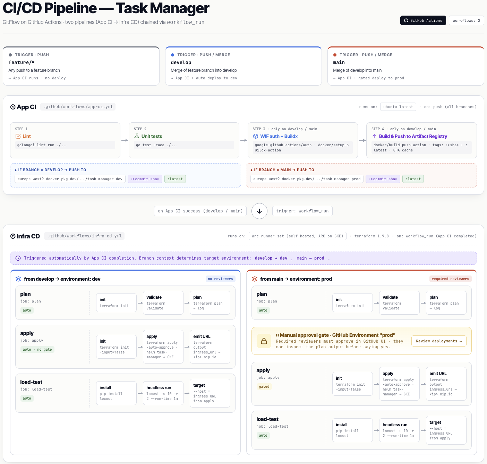

# Task Manager API

Production-ready Task Manager REST API built with Go, Clean Architecture, PostgreSQL, and deployed via Helm/Terraform.

## Requirements

- Go 1.23+
- PostgreSQL (CloudSQL, RDS, or local)
- Docker (for building image)
- Kubernetes cluster with Helm
- Terraform 1.9+ (for deployment; CI pins 1.9.8)

# [Deployment instructions](./DEPLOYMENTS.md)

# [Application](./app/README.md)

## Architecture diagrams

### Dev environment — zonal GKE in `europe-west9-a`

Source: [`docs/infra-dev.html`](./docs/infra-dev.html)

### Prod environment — regional GKE across 3 zones

Source: [`docs/infra-prod.html`](./docs/infra-prod.html)

### CI/CD pipeline — App CI → Infra CD via `workflow_run`

Source: [`docs/cicd-pipeline.html`](./docs/cicd-pipeline.html)
