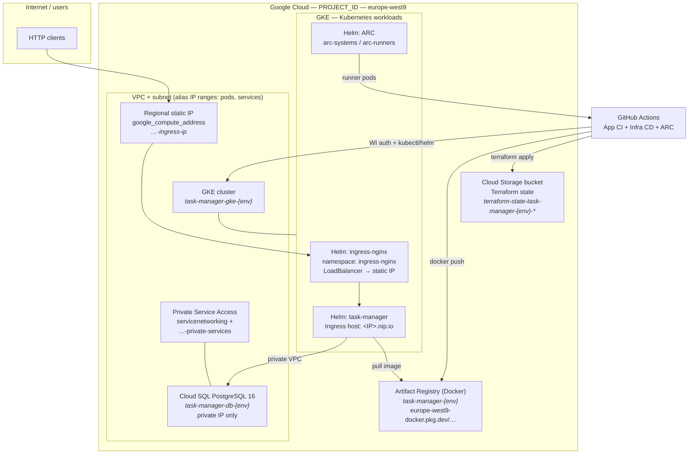

# Deployed solution — Dev & Prod (Google Cloud)

This document reflects the Terraform layout under `environments/dev` and `environments/prod` and the shared modules in `modules/`.

---

## Legend — Google Cloud products & icons

| Product | Icon | Role in this repo |
|--------|:----:|-------------------|
| **Google Cloud** |  | Host project, IAM, APIs |
| **VPC** (Virtual Private Cloud) |  | `google_compute_network`, subnet, PSA for Cloud SQL |
| **Cloud Load Balancing** (L4/L7 via Service) |  | Regional static IP on **Ingress NGINX** `LoadBalancer` service |
| **Google Kubernetes Engine (GKE)** |  | Standard cluster + node pool, Workload Identity |
| **Artifact Registry** |  | Docker/OCI repository for `task-manager` images (`…-docker.pkg.dev`) |
| **Cloud SQL** (PostgreSQL) |  | Private PostgreSQL 16, app DB + user |
| **Cloud Storage** |  | Terraform remote state (GCS backend) |
| **GitHub Actions** |  | App CI → image push; Infra CD; **ARC** runners on GKE |

> If an icon fails to load (CDN block), the **resource names in the diagrams and tables** are still the source of truth.

---

## Logical architecture (one environment)

Same pattern for **dev** and **prod**; only names and buckets differ (see tables below).



---

## Dev vs prod — Terraform naming cheat sheet

| Layer | **Dev** | **Prod** |
|--------|---------|----------|
| **VPC** | `task-manager-dev-vpc` | `task-manager-prod-vpc` |
| **Subnet** | `task-manager-dev-subnet` | `task-manager-prod-subnet` |
| **PSA reserved range** | `task-manager-dev-private-services` | `task-manager-prod-private-services` |
| **Ingress static IP** | `task-manager-dev-ingress-ip` | `task-manager-prod-ingress-ip` |
| **GKE cluster** | `task-manager-gke-dev` | `task-manager-gke-prod` |
| **Node pool** | `task-manager-dev-pool` | `task-manager-prod-pool` |
| **GKE node SA** | `task-manager-dev-gke-nodes@PROJECT_ID.iam.gserviceaccount.com` | `task-manager-prod-gke-nodes@PROJECT_ID.iam.gserviceaccount.com` |
| **Cloud SQL instance** | `task-manager-db-dev` | `task-manager-db-prod` |
| **Artifact Registry repo** | `task-manager-dev` | `task-manager-prod` |
| **Image (pattern)** | `europe-west9-docker.pkg.dev/PROJECT_ID/task-manager-dev/task-manager:TAG` | `europe-west9-docker.pkg.dev/PROJECT_ID/task-manager-prod/task-manager:TAG` |
| **App URL (output)** | `http://<ingress_static_ip>.nip.io` | same pattern |
| **Terraform state (GCS)** | Bucket `terraform-state-task-manager-dev-492216`, prefix `env/dev` | Bucket `terraform-state-task-manager-prod-492216`, prefix `env/prod` |

Secondary ranges on the subnet (for GKE alias IPs) use the logical names **`pods`** and **`services`** (`variables.tf` defaults).

---

## Request path (Task Manager API)

```mermaid
sequenceDiagram
  participant Client
  participant IP as Regional static IP<br/>(Compute Engine address)
  participant LB as Service type LoadBalancer<br/>ingress-nginx
  participant IG as Ingress task-manager<br/>nginx class
  participant Pod as task-manager pods<br/>Deployment + HPA
  participant DB as Cloud SQL PostgreSQL<br/>private IP

  Client->>IP: HTTP :80
  IP->>LB: forward
  LB->>IG: Host &lt;ip&gt;.nip.io
  IG->>Pod: route /
  Pod->>DB: DATABASE_URL (private)
```

---

## CI/CD touchpoints (names only)

| Step | Google Cloud / GitHub |
|------|------------------------|
| Build image | **Artifact Registry** repositories above |
| Deploy infra | **GCS** state bucket + **GKE** / **Cloud SQL** / **VPC** updates via Terraform |
| Ingress | **Compute Engine** regional external IP + **GKE** Ingress NGINX |
| Self-hosted runners | **GKE** pods (ARC Helm releases) calling **GitHub** |

---

## Module map (repo layout)

```text
environments/{dev,prod}/main.tf
├── module.network     → VPC, subnet, PSA, ingress IP
├── module.gke         → GKE cluster, node pool, node SA + IAM
├── module.database    → Cloud SQL instance, DB, user
├── module.artifact_registry → Artifact Registry (DOCKER)
├── module.helm        → ingress-nginx + task-manager (Helm)
└── module.arc         → Actions Runner Controller scale set (Helm)
```

---

*Generated from the Terraform in this repository; apply `terraform state list` in each environment for the live inventory if names were customized in `tfvars`.*
